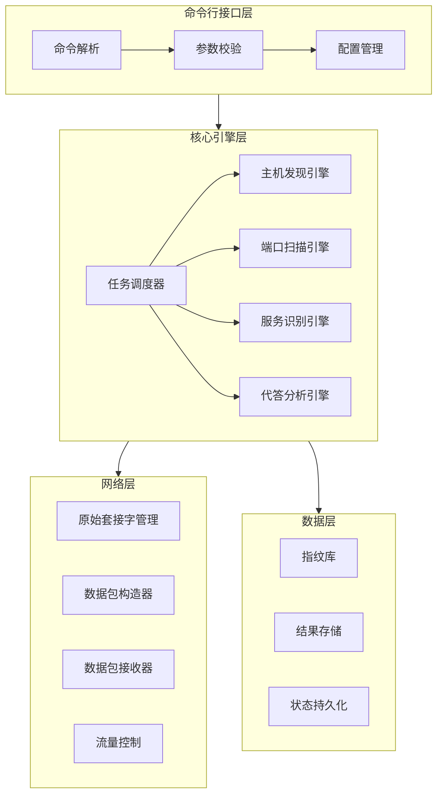
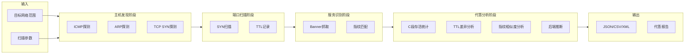

# 资产探测工具技术设计文档

Feature Name: asset-probe-tool
Updated: 2026-02-26

## 描述

本文档定义了资产探测工具的技术架构和实现方案。该工具采用Go语言开发，参考nmap和masscan的实现逻辑，实现高性能的网络资产探测能力，核心特色是代答资产识别和真实后端推断。

## 架构

### 整体架构图



### 数据流架构



## 组件和接口

### 1. 命令行接口 (cmd/)

#### 1.1 主入口 (cmd/probe/main.go)

```go
type Config struct {
    TargetCIDR      string        // 目标网络范围
    PortRange       string        // 端口范围
    Rate            int           // 发包速率 PPS
    Concurrency     int           // 并发数
    Timeout         time.Duration // 超时时间
    OutputFormat    string        // 输出格式
    OutputFile      string        // 输出文件
    Resume          bool          // 是否恢复扫描
    ScanType        string        // 扫描类型: full/quick/custom
}
```

#### 1.2 命令参数设计

| 参数 | 简写 | 默认值 | 说明 |
|------|------|--------|------|
| --target | -t | 必填 | 目标网络范围，CIDR格式，支持多个 |
| --ports | -p | 1-65535 | 端口范围 |
| --rate | -r | 10000 | 发包速率(PPS) |
| --concurrency | -c | 1000 | 并发数 |
| --timeout | | 3s | 响应超时时间 |
| --output | -o | result.json | 输出文件路径 |
| --format | -f | json | 输出格式: json/csv/xml |
| --resume | | false | 恢复上次扫描 |
| --scan-type | | full | 扫描类型: full/quick/custom |
| --interface | -i | auto | 网络接口 |

### 2. 核心引擎 (internal/engine/)

#### 2.1 任务调度器 (scheduler.go)

```go
type Scheduler interface {
    AddTarget(ip net.IP, ports []int)
    Start() error
    Pause() error
    Resume() error
    Stop() error
    Status() ScanStatus
}

type ScanStatus struct {
    TotalHosts      int
    ScannedHosts    int
    TotalPorts      int
    ScannedPorts    int
    StartTime       time.Time
    EstimatedEnd    time.Time
    CurrentRate     int
}
```

#### 2.2 主机发现引擎 (discovery.go)

```go
type HostDiscovery interface {
    Discover(ctx context.Context, cidr string) ([]HostInfo, error)
}

type HostInfo struct {
    IP           net.IP
    MAC          net.HardwareAddr
    Hostname     string
    DiscoveryWay string // icmp/arp/tcp
    TTL          int
    RespondTime  time.Duration
}
```

#### 2.3 端口扫描引擎 (scanner.go)

```go
type PortScanner interface {
    Scan(ctx context.Context, targets []ScanTarget) ([]ScanResult, error)
}

type ScanTarget struct {
    IP    net.IP
    Ports []int
}

type ScanResult struct {
    IP         net.IP
    Port       int
    Protocol   string // tcp/udp
    State      string // open/closed/filtered
    TTL        int
    Banner     []byte
    Service    ServiceInfo
    IsProxy    bool
    ProxyInfo  *ProxyInfo
}

type ProxyInfo struct {
    Type         string // reverse-proxy/lb/firewall
    Confidence   float64
    BackendIP    net.IP
    BackendPort  int
    Evidence     []string
}
```

#### 2.4 服务识别引擎 (service.go)

```go
type ServiceDetector interface {
    Detect(ctx context.Context, ip net.IP, port int) (ServiceInfo, error)
}

type ServiceInfo struct {
    Name        string
    Version     string
    Product     string
    OSType      string
    CPE         string
    Fingerprint string
    RawBanner   string
    Extra       map[string]string
}
```

#### 2.5 代答分析引擎 (proxy_analyzer.go)

```go
type ProxyAnalyzer interface {
    Analyze(results []ScanResult) []ProxyAnalysis
    InferBackend(proxyIP net.IP, proxyPort int) (net.IP, int, error)
}

type ProxyAnalysis struct {
    Cidr              string
    IsProxySubnet     bool
    AliveHostCount    int
    TotalHostCount    int
    ProxyType         string
    Confidence        float64
    AffectedIPs       []net.IP
    InferredBackends  []BackendInfo
    TTLDifferences    map[string]int
    FingerprintMatch  map[string]int
}

type BackendInfo struct {
    IP         net.IP
    Port       int
    Service    string
    Confidence float64
    Evidence   []string
}
```

### 3. 网络层 (internal/network/)

#### 3.1 原始套接字管理 (socket.go)

```go
type RawSocket interface {
    Send(packet []byte) error
    Receive() ([]byte, error)
    SetTimeout(d time.Duration)
    Close() error
}

func NewRawSocket(interfaceName string, protocol layers.IPProtocol) (RawSocket, error)
```

#### 3.2 数据包构造器 (packet.go)

```go
type PacketBuilder interface {
    BuildICMP(ip net.IP) ([]byte, error)
    BuildARP(ip net.IP) ([]byte, error)
    BuildSYN(ip net.IP, port int, srcPort int) ([]byte, error)
    BuildProbe(ip net.IP, port int, payload []byte) ([]byte, error)
}

type PacketParser interface {
    ParseICMP(data []byte) (*ICMPResponse, error)
    ParseTCP(data []byte) (*TCPResponse, error)
    ParseUDP(data []byte) (*UDPResponse, error)
}
```

#### 3.3 流量控制 (ratelimit.go)

```go
type RateLimiter interface {
    Wait()
    SetRate(pps int)
}

type TokenBucket struct {
    rate     int
    interval time.Duration
    tokens   chan struct{}
}
```

### 4. 数据层 (internal/data/)

#### 4.1 指纹库 (fingerprint.go)

```go
type FingerprintDB interface {
    Load(filePath string) error
    Match(banner string) (ServiceInfo, bool)
    AddFingerprint(fp Fingerprint) error
}

type Fingerprint struct {
    Service   string
    Product   string
    Version   string
    Pattern   string
    CPES      []string
    MatchType string // regex/exact/fuzzy
}
```

指纹库采用nmap-service-probes格式兼容设计。

#### 4.2 结果存储 (storage.go)

```go
type ResultStorage interface {
    Save(results []ScanResult) error
    Load(filePath string) ([]ScanResult, error)
    Export(format string, filePath string) error
}

type StateStorage interface {
    SaveState(state ScanState) error
    LoadState(filePath string) (*ScanState, error)
}

type ScanState struct {
    LastIP      net.IP
    LastPort    int
    Completed   []string
    InProgress  []string
    Timestamp   time.Time
}
```

### 5. 代答检测算法 (internal/analysis/)

#### 5.1 C段存活检测

```go
func DetectProxySubnet(results []ScanResult) []ProxyAnalysis {
    subnetMap := make(map[string][]ScanResult)
    
    for _, r := range results {
        if r.State == "open" {
            subnet := getSubnetC(r.IP)
            subnetMap[subnet] = append(subnetMap[subnet], r)
        }
    }
    
    var analyses []ProxyAnalysis
    for cidr, hosts := range subnetMap {
        aliveCount := countUniqueIPs(hosts)
        if aliveCount >= 254 {
            analyses = append(analyses, ProxyAnalysis{
                Cidr:           cidr,
                IsProxySubnet:  true,
                AliveHostCount: aliveCount,
                TotalHostCount: 256,
                ProxyType:      "nat-proxy",
                Confidence:     0.9,
                AffectedIPs:    getIPsFromResults(hosts),
            })
        }
    }
    return analyses
}
```

#### 5.2 TTL差异分析

```go
func AnalyzeTTLDifference(results []ScanResult) map[string][]int {
    ipTTLMap := make(map[string][]int)
    
    for _, r := range results {
        if r.State == "open" && r.TTL > 0 {
            ipTTLMap[r.IP.String()] = append(ipTTLMap[r.IP.String()], r.TTL)
        }
    }
    
    differences := make(map[string][]int)
    for ip, ttls := range ipTTLMap {
        if hasSignificantDifference(ttls, 3) {
            differences[ip] = ttls
        }
    }
    return differences
}

func hasSignificantDifference(ttls []int, threshold int) bool {
    if len(ttls) < 2 {
        return false
    }
    min, max := ttls[0], ttls[0]
    for _, t := range ttls {
        if t < min { min = t }
        if t > max { max = t }
    }
    return (max - min) > threshold
}
```

#### 5.3 指纹相似度分析

```go
func AnalyzeFingerprintSimilarity(results []ScanResult) map[string][]net.IP {
    fingerprintMap := make(map[string][]net.IP)
    
    for _, r := range results {
        if r.Service.Fingerprint != "" {
            key := r.Service.Fingerprint
            fingerprintMap[key] = append(fingerprintMap[key], r.IP)
        }
    }
    
    similarGroups := make(map[string][]net.IP)
    for fp, ips := range fingerprintMap {
        if len(ips) > 1 {
            similarGroups[fp] = ips
        }
    }
    return similarGroups
}
```

#### 5.4 后端推断算法

```go
func InferBackend(proxyIP net.IP, proxyPort int, results []ScanResult) (BackendInfo, error) {
    var backend BackendInfo
    
    // 方法1: HTTP头分析
    if header := extractHTTPHeaders(results, proxyIP, proxyPort); header != nil {
        if realIP := header.Get("X-Real-IP"); realIP != "" {
            backend.IP = net.ParseIP(realIP)
            backend.Evidence = append(backend.Evidence, "X-Real-IP header")
            backend.Confidence += 0.3
        }
        if forwarded := header.Get("X-Forwarded-For"); forwarded != "" {
            ips := strings.Split(forwarded, ",")
            if len(ips) > 0 {
                backend.IP = net.ParseIP(strings.TrimSpace(ips[0]))
                backend.Evidence = append(backend.Evidence, "X-Forwarded-For header")
                backend.Confidence += 0.3
            }
        }
    }
    
    // 方法2: TTL跳数推断
    if ttl := getAverageTTL(results, proxyIP); ttl > 0 {
        hops := 64 - ttl
        if hops > 0 {
            backend.Evidence = append(backend.Evidence, fmt.Sprintf("TTL hop count: %d", hops))
            backend.Confidence += 0.2
        }
    }
    
    // 方法3: 服务指纹一致性分析
    if similarIPs := findSimilarFingerprintIPs(results, proxyIP); len(similarIPs) > 0 {
        backend.Evidence = append(backend.Evidence, 
            fmt.Sprintf("Similar fingerprints with %d other IPs", len(similarIPs)))
        backend.Confidence += 0.2
    }
    
    // 方法4: 端口映射推断
    if mappedPort := inferPortMapping(proxyPort); mappedPort > 0 {
        backend.Port = mappedPort
        backend.Evidence = append(backend.Evidence, "Port mapping inference")
    }
    
    if backend.Confidence > 0.5 {
        return backend, nil
    }
    return backend, errors.New("insufficient evidence for backend inference")
}
```

## 数据模型

### 扫描结果模型

```mermaid
erDiagram
    Host ||--o{ Port : has
    Port ||--o| Service : runs
    Port ||--o| Proxy : may_have
    
    Host {
        net.IP ip PK
        string hostname
        string os_type
        int avg_ttl
        bool is_proxy_subnet
    }
    
    Port {
        int number PK
        string protocol
        string state
        int ttl
        int host_id FK
    }
    
    Service {
        string name
        string product
        string version
        string fingerprint
        string raw_banner
        int port_id FK
    }
    
    Proxy {
        string type
        float confidence
        net.IP backend_ip
        int backend_port
        string[] evidence
        int port_id FK
    }
```

### 配置文件结构 (config.yaml)

```yaml
scan:
  default_rate: 10000
  max_rate: 100000
  default_timeout: 3s
  max_concurrent: 5000

discovery:
  methods:
    - icmp
    - arp
    - tcp_syn
  tcp_probe_ports:
    - 80
    - 443
    - 22
    - 3389

service:
  probe_timeout: 5s
  max_probes: 10
  fingerprint_db: ./data/nmap-service-probes

proxy_detection:
  subnet_threshold: 254
  ttl_diff_threshold: 3
  confidence_threshold: 0.5

output:
  default_format: json
  include_raw_banner: true
  pretty_print: false
```

## 正确性属性

### 扫描正确性

1. **目标完整性**: 所有指定范围内的IP和端口都必须被扫描
2. **结果准确性**: 开放端口判断基于TCP握手响应，误报率 < 1%
3. **状态一致性**: 扫描状态文件必须准确反映当前进度

### 代答检测正确性

1. **C段检测**: 存活主机数 >= 254 才标记为代答网段
2. **TTL分析**: TTL差异 > 3 才判定为可疑
3. **置信度计算**: 基于多因子加权，阈值 >= 0.5 才输出推断结果

### 性能约束

1. **内存限制**: 峰值内存 < 4GB
2. **速率限制**: 默认10K PPS，最大100K PPS
3. **并发限制**: 默认1000，最大5000

## 错误处理

### 网络错误

| 错误类型 | 处理策略 |
|----------|----------|
| 权限不足 | 提示使用root权限执行 |
| 接口不存在 | 列出可用接口并退出 |
| 网络不可达 | 跳过该目标，记录日志 |
| 超时 | 标记为filtered，继续扫描 |

### 数据错误

| 错误类型 | 处理策略 |
|----------|----------|
| 指纹库格式错误 | 记录警告，跳过该条目 |
| 结果文件写入失败 | 重试3次后退出 |
| 状态文件损坏 | 从头开始扫描 |

### 并发错误

| 错误类型 | 处理策略 |
|----------|----------|
| goroutine泄漏 | 使用context控制生命周期 |
| channel阻塞 | 设置缓冲区，超时丢弃 |
| 资源耗尽 | 降低并发度，记录警告 |

## 测试策略

### 单元测试

- 包覆盖率目标: 80%
- 重点测试: 代答检测算法、指纹匹配、结果解析

### 集成测试

- 本地网络扫描测试
- 模拟代答环境测试（使用docker-compose搭建代理环境）

### 性能测试

- 基准测试: 1000 IP扫描耗时
- 压力测试: 100K PPS稳定性
- 内存测试: 长时间运行内存泄漏检测

### 测试环境

```yaml
# docker-compose.yml for proxy test
version: '3'
services:
  backend:
    image: nginx
    networks:
      - internal
  
  proxy:
    image: nginx
    ports:
      - "80:80"
    volumes:
      - ./nginx.conf:/etc/nginx/nginx.conf
    networks:
      - internal
      - external

networks:
  internal:
    internal: true
  external:
```

## 项目结构

```
asset-probe/
├── cmd/
│   └── probe/
│       └── main.go
├── internal/
│   ├── engine/
│   │   ├── scheduler.go
│   │   ├── discovery.go
│   │   ├── scanner.go
│   │   ├── service.go
│   │   └── proxy_analyzer.go
│   ├── network/
│   │   ├── socket.go
│   │   ├── packet.go
│   │   ├── parser.go
│   │   └── ratelimit.go
│   ├── data/
│   │   ├── fingerprint.go
│   │   ├── storage.go
│   │   └── state.go
│   ├── analysis/
│   │   ├── subnet_analyzer.go
│   │   ├── ttl_analyzer.go
│   │   └── backend_inferrer.go
│   └── output/
│       ├── json.go
│       ├── csv.go
│       └── xml.go
├── pkg/
│   └── utils/
│       ├── ip.go
│       └── port.go
├── data/
│   └── nmap-service-probes
├── config/
│   └── config.yaml
├── go.mod
├── go.sum
├── Makefile
└── README.md
```

## 依赖库

| 库 | 版本 | 用途 |
|----|------|------|
| github.com/google/gopacket | v1.1.19 | 数据包构造和解析 |
| github.com/spf13/cobra | v1.8.0 | 命令行框架 |
| github.com/spf13/viper | v1.18.0 | 配置管理 |
| golang.org/x/net | latest | 网络工具 |
| github.com/json-iterator/go | v1.1.12 | 高性能JSON |

## 实现计划

| 阶段 | 任务 | 预计时间 |
|------|------|----------|
| 1 | 项目框架搭建 + 命令行接口 | 1天 |
| 2 | 网络层实现（原始套接字、数据包） | 2天 |
| 3 | 主机发现引擎 | 1天 |
| 4 | 端口扫描引擎 | 2天 |
| 5 | 服务识别引擎 | 2天 |
| 6 | 代答分析引擎 | 2天 |
| 7 | 结果输出模块 | 1天 |
| 8 | 测试和优化 | 2天 |

## 参考资料

[^1]: nmap源码 - https://github.com/nmap/nmap
[^2]: masscan源码 - https://github.com/robertdavidgraham/masscan
[^3]: gopacket库 - https://github.com/google/gopacket
[^4]: nmap-service-probes格式 - https://nmap.org/book/vscan-fileformat.html
